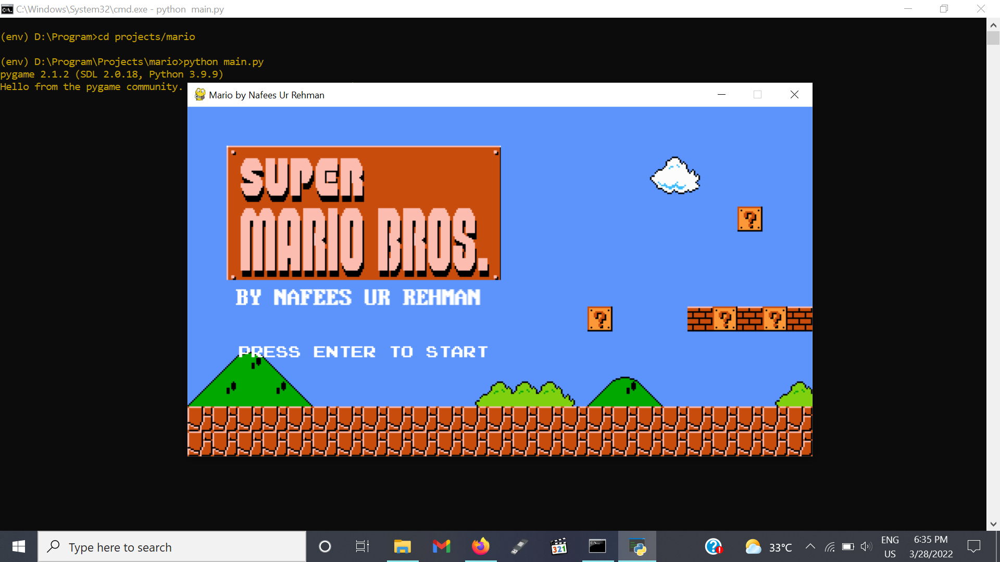
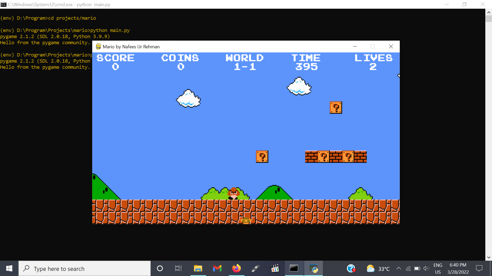

# Super-Mario-Game
> A nostalgic game that is created using pygame library in python. <br/>
> This program is intended to demonstrate the usage of pygame library it's created for educational purposes only.
## Screenshots:


## Requirements to run the program:
> pygame==2.1.2 <br/>
> pytmx==2.1.2
## How to Download:
```
git clone https://github.com/Nafees7/Super-Mario-Game.git
```
## Installation:
> python -m pip install -r requirements.txt
## How to run:
> cd Super-Mario-Game
> python main.py
#### Created by Nafees Ur Rehman 
